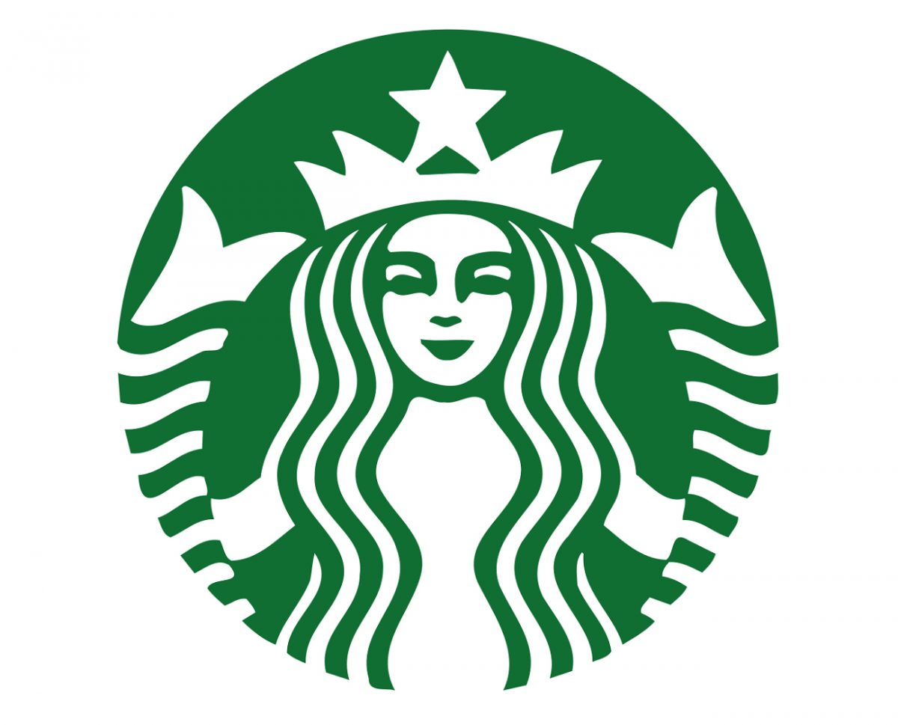
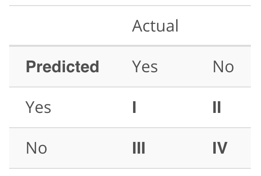

# Disaster Response Pipeline Project

## Table of Contents
1. [Description](#description)
2. [Goal](#goal)
3. [Files in the repository](#files)
4. [License](#license)
5. [Acknowledgement](#acknowledgement)

## Description

The dataset was originally used as a take-home assignment provided by Starbucks for their job candidates. The data for this exercise consists of about 120,000 data points split in a 2:1 ratio among training and test files. In the experiment simulated by the data, an advertising promotion was tested to see if it would bring more customers to purchase a specific product priced at $10. Since it costs the company 0.15 to send out each promotion, it would be best to limit that promotion only to those that are most receptive to the promotion. Each data point includes one column indicating whether or not an individual was sent a promotion for the product, and one column indicating whether or not that individual eventually purchased that product. Each individual also has seven additional features associated with them, which are provided abstractly as V1-V7.

## Goal
The task is to use the training data to understand what patterns in V1-V7 indicate that a promotion should be provided to a user. Specifically, your goal is to maximize the following metrics:

1. Incremental Response Rate (IRR)

IRR depicts how many more customers purchased the product with the promotion, as compared to if they didn't receive the promotion. Mathematically, it's the ratio of the number of purchasers in the promotion group to the total number of customers in the purchasers group (treatment) minus the ratio of the number of purchasers in the non-promotional group to the total number of customers in the non-promotional group (control).

2. Net Incremental Revenue (NIR)

NIR depicts how much is made (or lost) by sending out the promotion. Mathematically, this is 10 times the total number of purchasers that received the promotion minus 0.15 times the number of promotions sent out, minus 10 times the number of purchasers who were not given the promotion.

After getting an optimization strategy, we can complete the `promotion_strategy` function to pass to the `test_results` function. From past data, we know there are four possible outcomes:

The metrics are only being compared for the individuals we predict should obtain the promotion – that is, quadrants I and II. Since the first set of individuals that receive the promotion (in the training set) receive it randomly, we can expect that quadrants I and II will have approximately equivalent participants.

Comparing quadrant I to II then gives an idea of how well your promotion strategy will work in the future.

## License

## Acknowledgements

* [Udacity](https://www.udacity.com/) for providing the project
* [Starbucks](https://drive.google.com/file/d/18klca9Sef1Rs6q8DW4l7o349r8B70qXM/view) for providing dataset
